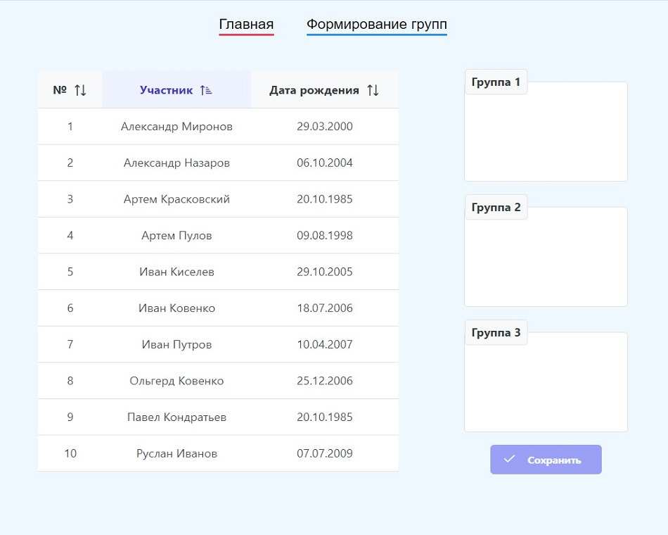
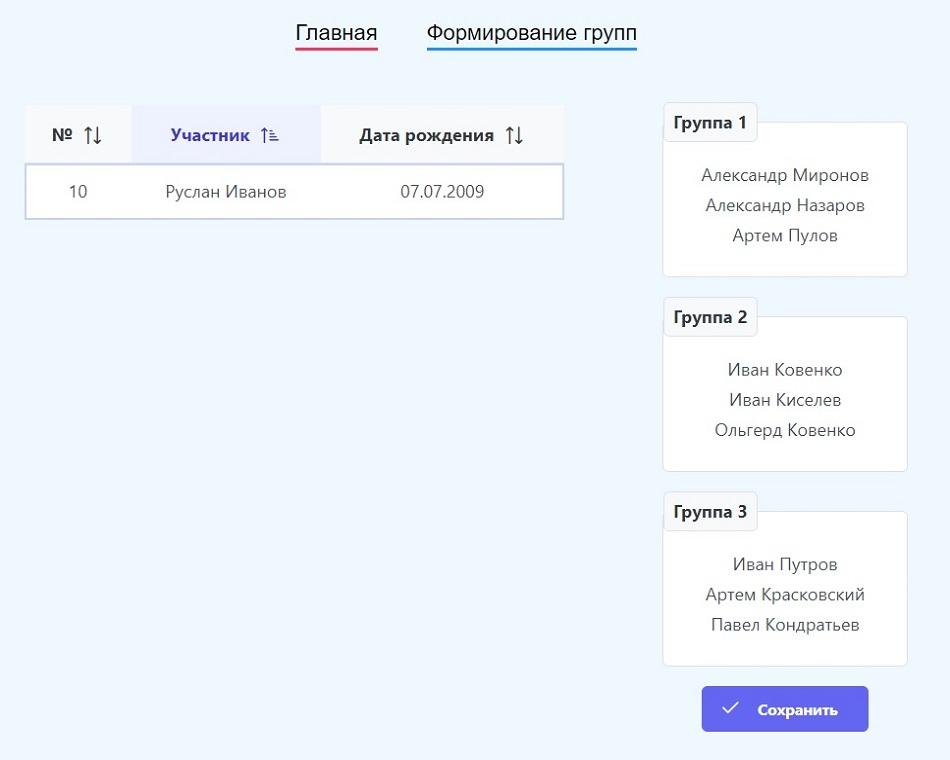
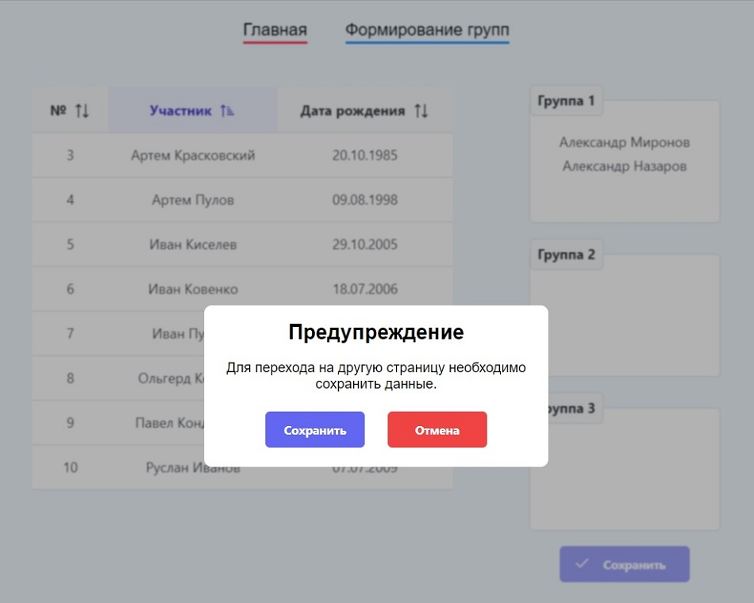

# Тестовое приложение на Vue

**О проекте:**
Приложение с возможностью размещения игроков по группам.<br>

Распределение игроков по группам осуществляется последовательным выбором игроков с помощью двойного нажатия левой
кнопкой мыши в списке игроков, при этом выбранный игрок из списка удаляется.<br>
Удаление из группы игрока осуществляется двойным нажатием на поле «Фамилия имя» в соответствующей группе. 
При удалении игрока из группы игрок попадает обратно в исходный список игроков согласно алфавитному порядку.

В случае если группы были изменены, пользователю запрещено перемещаться на главную страницу. 
При попытке перехода появится модальное окно с возможностью сохранения данных.

**Управление:**<br>
Кнопка "Сохранить" - сохранение данных групп для отправки на сервер. 
Сохраненные данные выводятся в консоль.

Примечание: Кнопка "Сохранить" становится активной при полном заполнении групп.

## Изображения

### Начальный экран

 

### Заполнение групп

 

### Предупреждение

 

## Установка

```bash
git clone https://github.com/Krasivoe/anlim-test-vue.git
cd anlim-test-vue
npm install
```

## Сборка development

```bash
npm run serve
```

## Сборка production

```bash
npm run build
```
